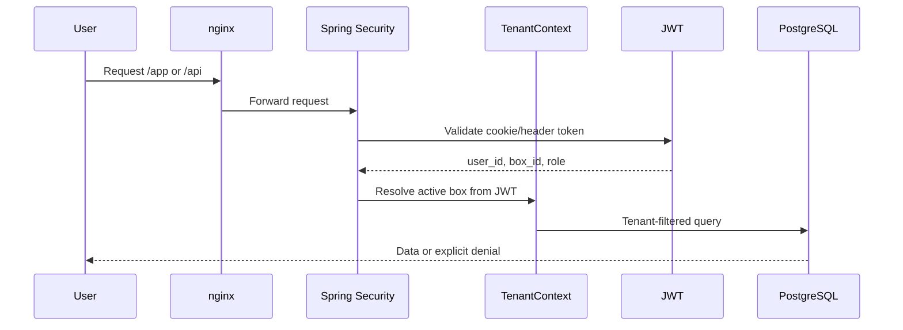

# rxed

<p>
  <strong>rxed</strong> (formerly BoxHub) is a multi-tenant CrossFit box platform for athletes,
  coaches, box admins and the gym floor. It brings booking, programming, score tracking and the
  whiteboard TV into one product instead of the 3-5 tools a box usually stitches together.
</p>

[](https://angular.dev/) [](https://spring.io/projects/spring-boot)

> **Status:** active development. M0-M14a are on `main`; M21 (identity and tenancy for multi-box)
> is the next milestone. The roadmap is deliberately not ordered by milestone number.

The public product name is `rxed` and the domain is `rxed.app`. Internal namespaces still use the
original BoxHub name where changing them would be disruptive: `BOXHUB_*` environment variables,
`com.boxhub.*` Java packages, database/image names and `bh-*` UI components.

## Product Surface

- **Athletes:** phone-first home, today's WOD, class booking, waitlists, score logging, RX/scaled
  results, PRs, lift history, progress and leaderboards.
- **Coaches:** WOD and movement libraries, benchmarks, class building, programming, rosters,
  check-in, live class runner, timer control and coach-entered scores.
- **Box admins:** members, invites, plans, subscriptions, schedule, settings, movements, TVs,
  Stripe configuration and operational dashboard.
- **Superadmins:** box onboarding, approval queue, platform settings, suspension/reactivation and
  platform-level audit visibility.
- **TV whiteboard:** device pairing, live WOD/session state, timers, results and reconnect-aware
  updates on a dedicated `/tv` surface.
- **Accounts:** email verification, password reset, refresh-token rotation, session management,
  account deletion/export, optional Google SSO and locale-aware email/application plumbing.
- **Payments:** box-owned Stripe Checkout and webhooks, subscriptions, cash/transfer/card records
  and printable receipts. Payment data is tenant-scoped and sensitive keys are encrypted at rest.
- **Media:** small JPEG/PNG uploads, stored in a Docker volume and served through short-lived signed
  URLs. Maximum upload size is 5 MB.

```mermaid
flowchart LR
    A[Athlete] --> APP[Angular app]
    C[Coach] --> APP
    AD[Box admin] --> APP
    TV[TV / Fire Stick] --> BOARD[/tv board]
    APP --> API[Spring Boot API]
    BOARD --> API
    API --> DB[(PostgreSQL 16)]
    API --> MAIL[SMTP / Mailpit]
    API --> PAY[Stripe]
    API --> LIVE[SSE live state]
    LIVE --> BOARD
```

## Architecture

rxed is a modular monolith: one Spring Boot application with package boundaries, one Angular SPA,
one PostgreSQL database and a single-node Docker Compose deployment behind nginx.

| Layer | Technology | Responsibility |
|---|---|---|
| Frontend | Angular 22, standalone components, signals, TypeScript 6 | Role-based shells, auth, booking, programming, tracking, admin and TV screens |
| Backend | Spring Boot 3.5, Java 21, Spring Security, JPA | REST API, domain services, authorization, mail, OAuth2 and Actuator health |
| Data | PostgreSQL 16, Flyway | Relational data, JSONB workout structures, constraints and one-way migrations |
| Realtime | Server-Sent Events (SSE) | TV state and timer updates; clients reconnect and re-fetch state |
| Runtime | Docker Compose, nginx, Caffeine cache | Local stack and one-VPS deployment; no Kubernetes, Redis or broker required today |
| Integrations | Stripe, optional Google SSO, SMTP | Payments, OAuth login and transactional mail |

The application is served under `/app/`. Nginx keeps permanent redirects from legacy top-level
paths such as `/admin`, `/athlete`, `/coach`, `/auth`, `/join` and `/tv`, so existing links keep
working while the canonical routes live below `/app/`.

### Tenancy and security

- A user can hold a different role in each box: `ATHLETE`, `COACH` or `BOX_ADMIN`.
- The active box is resolved from the JWT and `TenantContext`, never from a request parameter.
- Tenant-owned tables use Hibernate `@TenantId` where appropriate; cross-box reads are explicit,
  not an accidental consequence of a missing tenant.
- Authentication uses short-lived JWT access tokens, rotating refresh-token families, httpOnly
  cookies, CSRF protection for cookie-authenticated writes and bcrypt passwords.
- Authorization is tested at route level. New box-scoped endpoints require happy-path,
  auth-denied and cross-tenant-denied coverage.
- Missing signing, media-link, encryption or database secrets fail startup rather than falling back
  to a working committed default.
- Audit rows are written inside the transaction; mail is sent only after the transaction commits.



## Repository Layout

```text
backend/       Spring Boot application, domain modules, Flyway migrations and tests
frontend/      Angular application, shared bh-* UI components and Karma specs
e2e/           Playwright flows, accessibility checks and visual regression runner
docker/        Compose stack, Dockerfiles, nginx config, env example and optional local TLS
deploy/        VPS deployment script
docs/          Specs, milestone plans, tenancy rules, ADRs, backlog and deployment context
PRODUCT.md     Product purpose, users and design principles
DESIGN.md      Shipped rxed visual system
CLAUDE.md      Binding engineering, tenancy, security and frontend rules
README.md      This document
```

## Quick Start

### Prerequisites

- Docker Desktop or Docker Engine with the Compose plugin
- Java 21 and Maven
- Node.js and npm
- A Chromium-compatible browser for frontend/e2e checks

For local backend builds on the standard Homebrew setup, use Java 21 explicitly because the system
JDK may be newer:

```bash
export JAVA_HOME=/opt/homebrew/opt/openjdk@21
```

### Full stack with Docker

This is the shortest path to a working local environment. The example file is intentionally
development-only and must never be deployed unchanged.

```bash
cp docker/.env.example docker/.env       # once
docker compose -f docker/docker-compose.yml up --build
```

Open `http://localhost` (redirects to `http://localhost/app/`). The backend health endpoint is
`http://localhost/actuator/health`; Mailpit's web UI is `http://localhost:8025`.

The dev profile seeds these local accounts:

| Role | Email | Password |
|---|---|---|
| Box admin | `admin@demo.io` | `boxhub-demo-2026` |
| Coach | `coach@demo.io` | `boxhub-demo-2026` |
| Athlete | `athlete@demo.io` | `boxhub-demo-2026` |
| Superadmin | `super@demo.io` | `boxhub-demo-2026` |

These credentials are for the dev profile only. Never enable `SPRING_PROFILES_ACTIVE=dev` in a
production environment.

### Run services separately

The backend needs PostgreSQL. The compose database can be used without starting the full stack:

```bash
docker compose -f docker/docker-compose.yml up -d db
cd backend && SPRING_PROFILES_ACTIVE=dev mvn spring-boot:run
```

For flows that send mail, start Mailpit too:

```bash
docker compose -f docker/docker-compose.yml up -d db mailpit
```

The frontend dev server proxies `/api` to `http://localhost:8080`:

```bash
cd frontend
npm install
npm start
```

Open `http://localhost:4200/app/` when running Angular separately. The admin panel is available at
`/app/admin` (the legacy `/admin` path redirects there). After logging in as `admin@demo.io`, the
panel covers members, schedule, invites, plans and settings. Scheduling and booking work as
follows: admins create weekly class templates at `/app/admin/schedule`, sessions are generated to
the booking horizon, athletes book at `/app/athlete/book`, waitlisted athletes are promoted when a
place is cancelled, and weekly plan limits plus the cancellation cutoff are enforced. Invites are
shareable one-time links and are also emailed through SMTP/Mailpit in the current implementation;
the older "no email sending yet" note was true before the account/onboarding milestones. Coaches
run rosters and check-in at `/app/coach/classes`; the legacy `/coach/sessions` path redirects to the
current route.

### Local HTTPS (optional)

Plain HTTP above remains the default. To exercise the local TLS profile, generate a self-signed
certificate once:

```bash
cd docker/dev-tls
openssl req -x509 -nodes -newkey rsa:2048 -days 825 \
  -keyout boxhub.local.key -out boxhub.local.crt \
  -subj "/CN=boxhub.local" \
  -addext "subjectAltName=DNS:boxhub.local"
```

Add `127.0.0.1 boxhub.local` to `/etc/hosts`, then run:

```bash
docker compose -f docker/docker-compose.yml --profile tls up -d --build
```

Open `https://boxhub.local`. The browser will warn because the certificate is self-signed; trust it
locally if needed. Set `BOXHUB_COOKIE_SECURE=true` in `docker/.env` and restart the backend to
exercise the `Secure` cookie attribute and HSTS.

This local setup cannot prove the Google OAuth `redirect_uri`, which needs a real registered domain,
or email deliverability, because Mailpit accepts everything. Both are Launch -> Production work.

## Testing

Run the relevant suite from the matching directory:

```bash
cd backend && mvn verify
cd frontend && npm test -- --watch=false --browsers=ChromeHeadless
cd e2e && npx playwright test
```

`cd frontend && npm test` remains the simple project command, but it starts Karma's watch mode;
use the one-shot command above for a gate.

The repository includes:

- Spring integration, domain, migration, security, tenancy, payment and mail tests using
  Testcontainers PostgreSQL where integration coverage is required.
- Angular Karma unit/component tests.
- Playwright user flows for authentication, onboarding, booking, programming, tracking,
  memberships, admin, account security and the TV/runner surfaces.
- `@axe-core/playwright` accessibility checks and visual regression baselines.

For visual baselines, use the Linux-container runner rather than Playwright locally:

```bash
cd e2e && ./visual.sh
```

Before trusting an end-to-end result, rebuild the frontend image and use a fresh
`docker compose down -v` stack. The TV, runner and tracking flows are not idempotent against dirty
state. CI runs the `ci` and `dependency-scan` jobs on push; a local green run is not the complete
gate.

## Deployment

Deploy with:

```bash
./deploy/deploy.sh user@vps
```

See the script header for VPS prerequisites. The target is a single-node OVHcloud VPS deployment
at `/opt/boxhub` using Docker Compose, nginx and the existing Postgres/media volumes. The script:

1. Requires Docker, the Compose plugin and `curl` on the VPS.
2. Requires `/opt/boxhub/docker/.env` to exist before syncing code.
3. Rejects development secrets and `SPRING_PROFILES_ACTIVE=dev` before `rsync --delete`.
4. Builds the images on the VPS and checks backend health through nginx.

Before a real deployment, regenerate every DEV-ONLY value in `docker/.env.example`, leave
`SPRING_PROFILES_ACTIVE` empty, set `BOXHUB_COOKIE_SECURE=true` behind HTTPS, configure real SMTP,
DNS, firewall and TLS, and establish independent PostgreSQL/media backups plus a restore drill.
The bundled Mailpit service and the TLS profile's development certificate are not production
solutions. Never put credentials, `.env` contents, tokens or encryption keys in documentation.

## Configuration

`docker/.env.example` is the source of truth for stack variables. Copy it to the gitignored
`docker/.env` for local work. Production must regenerate at least:

| Variable | Purpose |
|---|---|
| `BOXHUB_JWT_SECRET` | JWT signing key |
| `BOXHUB_MEDIA_LINK_SECRET` | Signed media URL key |
| `BOXHUB_STRIPE_ENC_KEYS` | Versioned encryption keys for Stripe credentials |
| `POSTGRES_PASSWORD` | Database password |
| `BOXHUB_APP_URL` | Public application origin and OAuth URL input |
| `BOXHUB_COOKIE_SECURE` | Secure auth cookies when serving HTTPS |
| `BOXHUB_GOOGLE_CLIENT_ID` / `BOXHUB_GOOGLE_CLIENT_SECRET` | Optional Google SSO |
| `BOXHUB_SMTP_*` | Transactional email provider |

The deploy script refuses the committed development values. Do not add secret fallbacks to
`application.yml` or Compose: a missing secret must stop startup.

## Roadmap

The current v3 programme changes the product from a box-only tool into a platform a person can use
with zero, one or several boxes. M14a has completed the class/programming model foundation. M21 is
the next backend milestone and makes identity and tenancy fail closed for boxless and multi-box
sessions. No M21 endpoints or screens are intended in that phase.

After that, the planned path is shared component consolidation, app entry and shells, classes and
builder surfaces, athlete, discovery, workout-scoped social, coach reservations, analytics, admin,
superadmin, Capacitor mobile packaging, landing, 2FA, beta, then the TV/class-runner project and
v1.0. Read the execution order instead of inferring it from labels:

- [`docs/ROADMAP-AT-A-GLANCE.md`](docs/ROADMAP-AT-A-GLANCE.md) - concise execution map
- [`docs/superpowers/specs/2026-08-18-v3-roadmap-platform-expansion.md`](docs/superpowers/specs/2026-08-18-v3-roadmap-platform-expansion.md) - programme boundaries and rationale
- [`docs/BACKLOG.md`](docs/BACKLOG.md) - deferred work, accepted decisions and watch-list

## Documentation Map

- [`CLAUDE.md`](CLAUDE.md) - binding project rules and workflow
- [`docs/HANDOFF.md`](docs/HANDOFF.md) - current state, shipped milestones and test gates
- [`docs/superpowers/specs/2026-07-07-boxhub-design.md`](docs/superpowers/specs/2026-07-07-boxhub-design.md) - master product and architecture spec for M0-M7
- [`docs/superpowers/specs/`](docs/superpowers/specs/) - milestone specifications
- [`docs/superpowers/plans/`](docs/superpowers/plans/) - milestone implementation plans
- [`docs/TENANCY.md`](docs/TENANCY.md) - authoritative tenancy rules and `@TenantId` pitfalls
- [`docs/PREFLIGHT.md`](docs/PREFLIGHT.md) - checks before briefs, gates, tests and completion claims
- [`docs/VPS-DEPLOYMENT.md`](docs/VPS-DEPLOYMENT.md) - agreed OVH target, storage and backup constraints
- [`PRODUCT.md`](PRODUCT.md) - product purpose, users and UX principles
- [`DESIGN.md`](DESIGN.md) - shipped dark-only rxed design system
- [`docs/adr/`](docs/adr/) - architectural decision records

## Engineering Rules

Milestone lock: work only on the active milestone. Schema changes are Flyway-only; never edit an
applied migration. Every box-scoped endpoint needs happy, auth-denied and cross-tenant-denied tests.
Use conventional commits and record irreversible decisions in `docs/adr/`. Put out-of-scope ideas
in [`docs/BACKLOG.md`](docs/BACKLOG.md), one line each.

Frontend work is token-driven and dark-only: use shared `bh-*` components, WCAG AA contrast and
focus states, 44px touch targets, loading/error/empty states, pending/error save states and
locale-aware formatting. Identity belongs on hero surfaces such as the WOD board, leaderboard,
progress, runner and TV; forms and tables stay conventional and clear. Archivo carries prose and
UI; JetBrains Mono carries prescribed and measured values.
